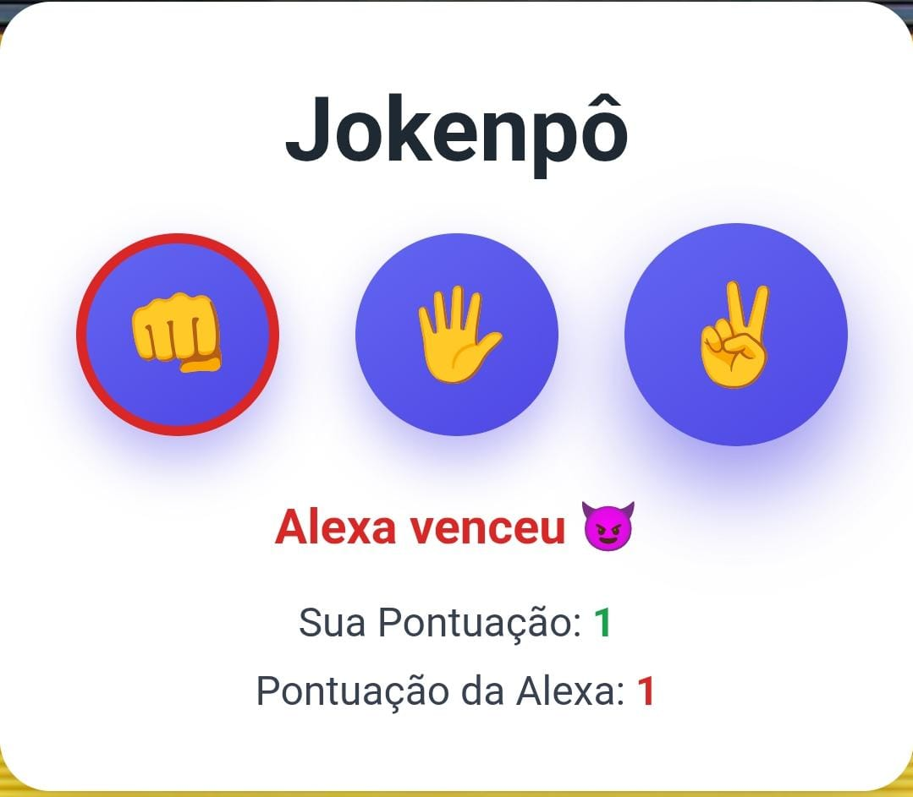

# 🎮 Dev-Jokenpo

Um jogo de **Pedra, Papel e Tesoura** desenvolvido em JavaScript onde o jogador enfrenta o computador.

O projeto foi criado com o objetivo de praticar lógica de programação, manipulação do DOM e interação com o usuário utilizando JavaScript.

---

# 🚀 Demonstração

🔗 Acesse o projeto online
https://cassymari.github.io/Game-Jokenpo./



---

# 🕹️ Como jogar

1. Escolha entre **Pedra**, **Papel** ou **Tesoura**
2. O computador fará uma escolha aleatória
3. O resultado será exibido na tela
4. A pontuação do jogador e do computador será atualizada automaticamente

---

# 🛠️ Tecnologias utilizadas


---

# 📂 Estrutura do projeto

```
Dev-Jokenpo
│
├── index.html
├── style.css
├── script.js
│
├── assets
│   ├── pedra.png
│   ├── papel.png
│   └── tesoura.png
│
└── README.md
```

---

# ✨ Funcionalidades

* Escolha entre pedra, papel ou tesoura
* Escolha aleatória do computador
* Sistema de pontuação
* Exibição do resultado da rodada
* Interface simples e intuitiva

---

# ⚙️ Como executar o projeto

1. Clone o repositório

```
git clone https://github.com/cassymari/dev-jokenpo.git
```

2. Abra a pasta do projeto

3. Execute o arquivo:

```
index.html
```

---

# 📈 Melhorias futuras

* Adicionar animações
* Melhorar interface do jogo
* Criar modo multiplayer
* Adicionar efeitos sonoros

---

# 👩‍💻 Autora

Projeto desenvolvido por **Cassiane M. Nascimento**
